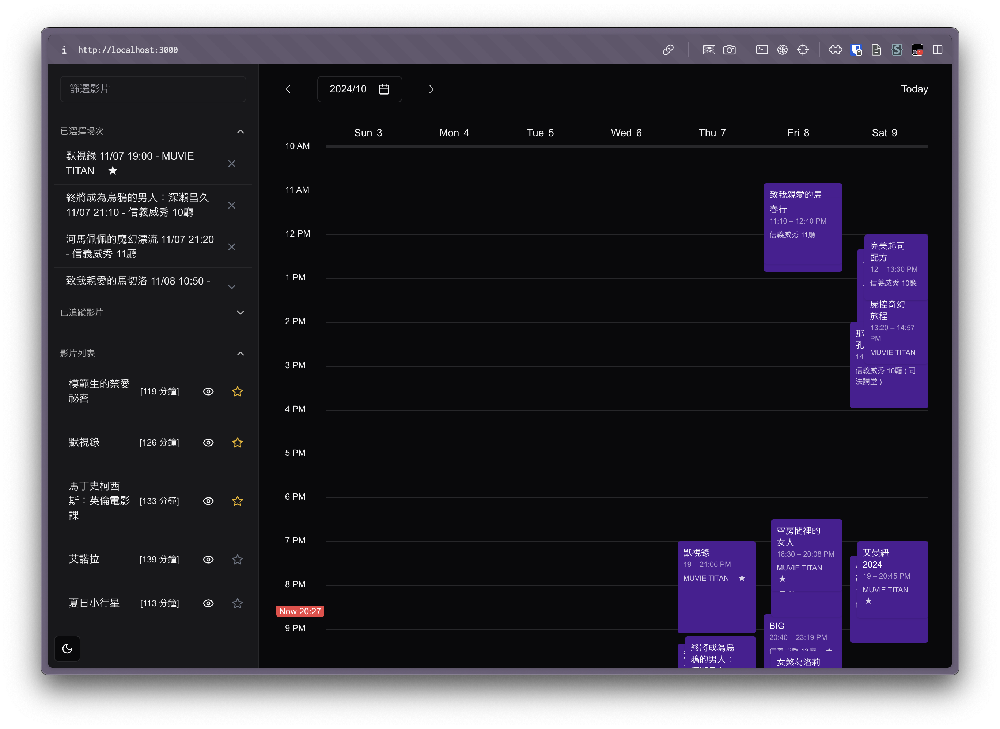
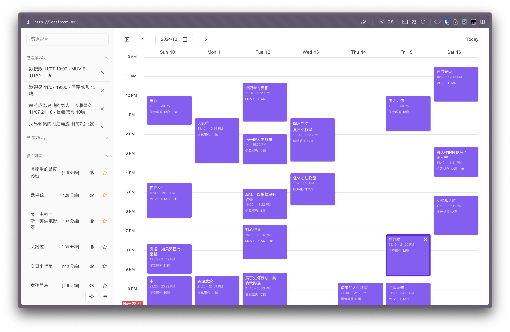

# film scheduler

金馬影展快要到了，想和去年一樣來場電影馬拉松看到飽的我，做了這個工具來幫忙選片

## Screenshots




## Demo

https://github.com/user-attachments/assets/1900be74-d6ad-4fe3-a109-ea61851e3ad4

## Development

```bash
pnpm install
```

## Roadmap

See [GitHub Project](https://github.com/users/Yukaii/projects/9/views/3)

## FAQs

### 為何要做這個專案？

我愛木須龍啦！

### 都 2024 年了怎麼還在弄行事曆啊？

窩不知道 Q_Q

## Credits

* 搜尋既有專案時找到 [cornguo/Moovee](https://github.com/cornguo/Moovee)
* 和電腦玩物的介紹: [https://www.playpcesor.com/2012/10/moovee-walla-group.html](https://www.playpcesor.com/2012/10/moovee-walla-group.html)

幫我快速釐清應該要有哪些功能！
